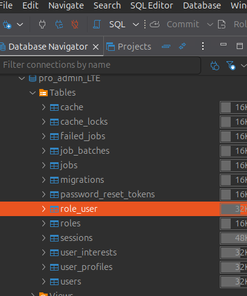
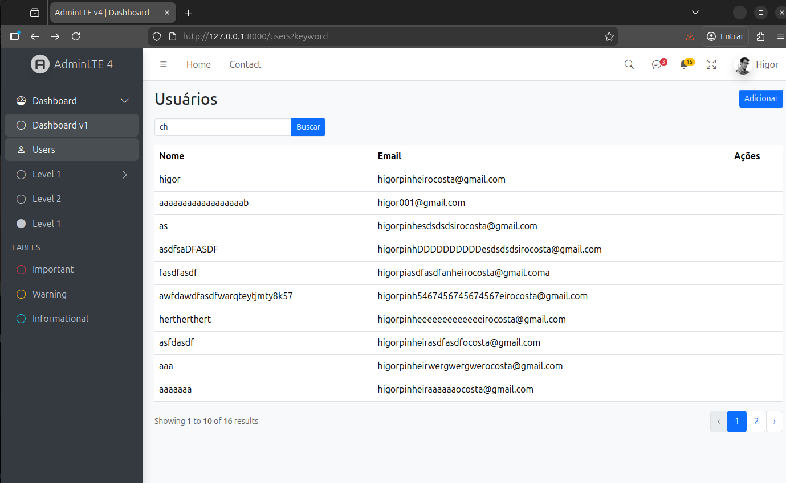
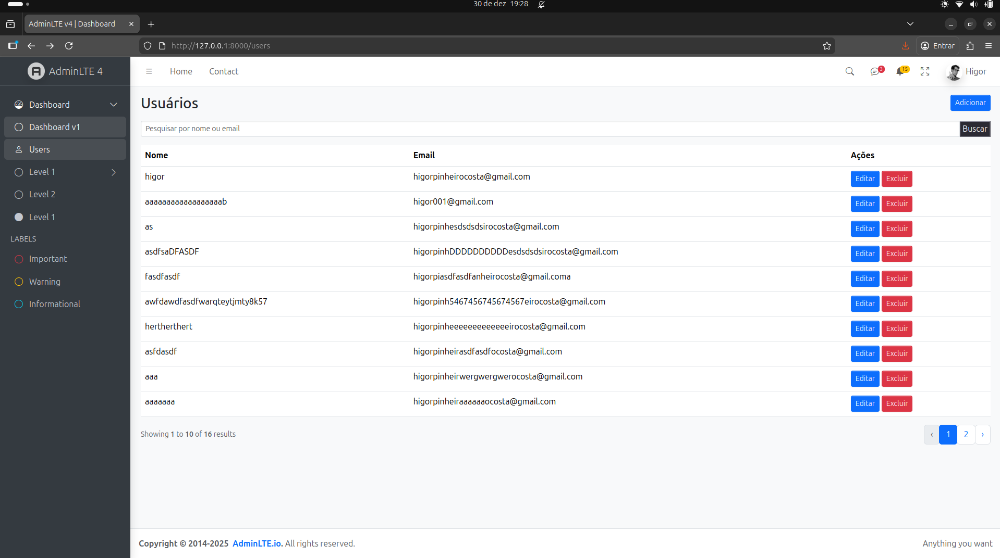
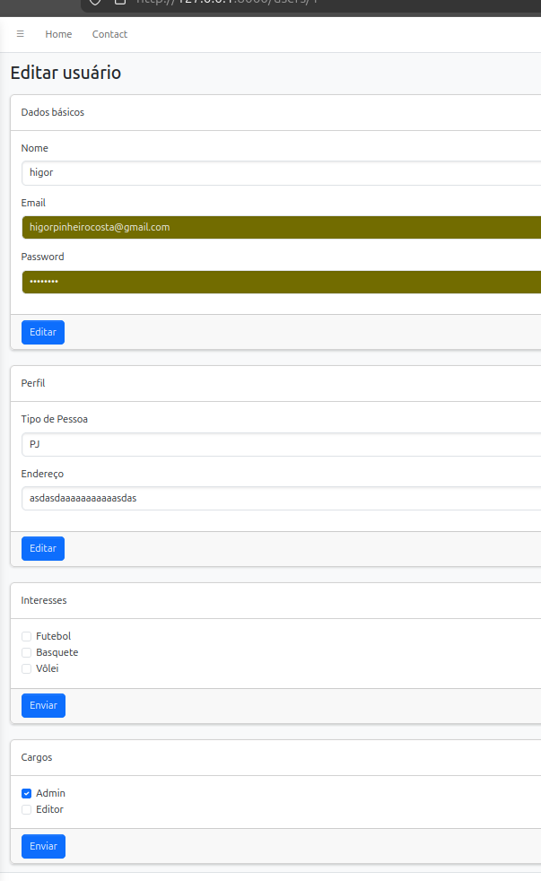
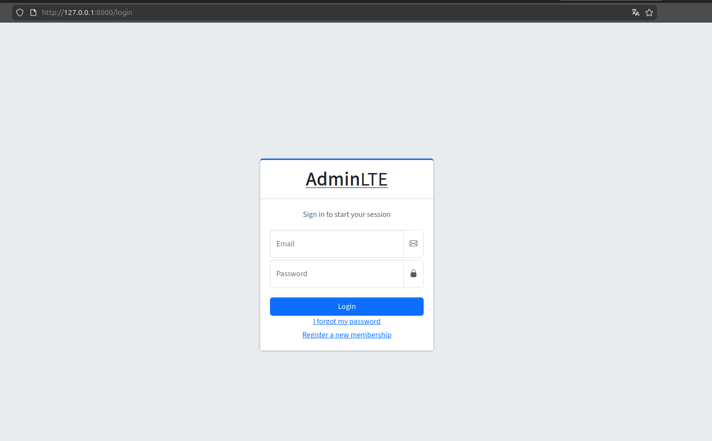

# 📊 Projeto Laravel com AdminLTE 4

Este projeto foi desenvolvido como **trabalho final de um curso de revisão completa de Laravel**, com o objetivo de consolidar os principais conceitos do framework através de um sistema administrativo funcional utilizando o **AdminLTE 4**.

O sistema implementa **CRUD de usuários**, **autenticação**, **autorização por cargos (roles)**, **perfil do usuário**, **interesses**, **paginação**, **busca**, e **relacionamentos entre tabelas**, servindo como um resumo prático de todo o conteúdo estudado.

---

## 🚀 Tecnologias Utilizadas

* **PHP 8+**
* **Laravel 11 e 12**
* **MySQL**
* **AdminLTE 4**
* **Blade Templates**
* **Eloquent ORM**
* **Laravel Auth & Policies**

---

## 🗂 Estrutura do Projeto

O projeto segue o padrão MVC do Laravel e utiliza o AdminLTE como base visual para o painel administrativo.

Principais tabelas do banco de dados:

* `users`
* `roles`
* `role_user`
* `user_profiles`
* `user_interests`
* `sessions`
* `password_reset_tokens`

> A tabela `role_user` é responsável pelo relacionamento **N:N** entre usuários e cargos.

---

## 🖼 Prints do Sistema

Abaixo estão os prints do sistema. 

### 1️⃣ Estrutura do Banco de Dados

📌 **Descrição da imagem**:
Tela do *Database Navigator* mostrando o banco `pro_admin_LTE` com as tabelas principais do sistema, incluindo `users`, `roles` e `role_user`.

```md
 
```

---

### 2️⃣ Erro de Autorização (403)

📌 **Descrição da imagem**:
Tela do navegador exibindo erro **403 – This action is unauthorized**, demonstrando o funcionamento das **Policies do Laravel** para controle de acesso.

```md

```

---

### 3️⃣ Listagem de Usuários (Busca Ativa)

📌 **Descrição da imagem**:
Tela de listagem de usuários no painel AdminLTE, com campo de busca por nome ou email e paginação ativa.

```md

```

---

### 4️⃣ CRUD de Usuários com Ações

📌 **Descrição da imagem**:
Listagem completa de usuários com botões de **Editar** e **Excluir**, demonstrando o CRUD funcional.

```md

```

---

### 5️⃣ Tela de Edição de Usuário

📌 **Descrição da imagem**:
Tela de edição de usuário contendo:

* Dados básicos (nome, email, senha)
* Perfil do usuário
* Interesses (checkbox)
* Cargos/Roles (Admin, Editor)

```md

```

### 6 Tela de Login de Usuário

📌 **Descrição da imagem**:
Tela de edição de usuário contendo:

* Dados básicos (nome, email, senha)
* Perfil do usuário
* Interesses (checkbox)
* Cargos/Roles (Admin, Editor)

```md

```

---

## 🔐 Funcionalidades Implementadas

* ✅ Autenticação de usuários
* ✅ Autorização com **Policies**
* ✅ CRUD completo de usuários
* ✅ Relacionamento N:N (Usuários x Cargos)
* ✅ Perfil do usuário (1:1)
* ✅ Interesses do usuário (N:N)
* ✅ Busca por nome/email
* ✅ Paginação
* ✅ Layout administrativo com AdminLTE 4

---

## ⚙️ Instalação do Projeto

### 1️⃣ Clonar o repositório

```bash
git clone https://github.com/seu-usuario/seu-repositorio.git
cd seu-repositorio
```

---

### 2️⃣ Instalar dependências

```bash
composer install
npm install
npm run build
```

---

### 3️⃣ Configurar o ambiente

Crie o arquivo `.env`:

```bash
cp .env.example .env
```

Configure as variáveis do banco de dados no `.env`:

```env
DB_DATABASE=pro_admin_lte
DB_USERNAME=root
DB_PASSWORD=
```

---

### 4️⃣ Gerar a key da aplicação

```bash
php artisan key:generate
```

---

### 5️⃣ Rodar as migrations e seeders

```bash
php artisan migrate --seed
```

---

### 6️⃣ Iniciar o servidor

```bash
php artisan serve
```

Acesse:

```
http://127.0.0.1:8000
```

---

## 👤 Usuário Padrão (Seeder)

```txt
Email: admin@admin.com
Senha: password
```

> O usuário admin possui permissão total no sistema.

---

## 🎯 Objetivo do Projeto

Este projeto foi desenvolvido com foco **educacional**, reunindo na prática:

* Conceitos fundamentais do Laravel
* Organização de código
* Boas práticas
* Autenticação e autorização
* Relacionamentos complexos

Servindo como **base sólida para projetos reais** e como portfólio no GitHub.

---

## 📚 Conteúdos e Tópicos Abordados no Curso

* Além das funcionalidades visíveis no sistema, o projeto consolida diversos conceitos fundamentais do Laravel, estudados ao longo do curso:

## 🔹 Fundamentos do Laravel

* Criação de aplicações web completas usando Laravel, o framework PHP mais popular do mercado

* Compreensão da arquitetura MVC (Model, View, Controller)

* Definição e organização de rotas, controladores e middlewares

## 🔹 Autenticação e Autorização

* Implementação de autenticação utilizando Laravel Fortify

* Bloqueio de rotas e controle de acesso desde o início do projeto

* Gerenciamento de permissões com Gates e Policies

## 🔹 Banco de Dados e ORM

* Integração com banco de dados MySQL

* Criação e versionamento do banco usando Migrations

* Geração de dados de teste com Seeders e Factories

* Uso avançado do Eloquent ORM e Query Builder para consultas eficientes

## 🔹 Front-end com Blade e AdminLTE

* Utilização do Blade Template Engine

* Criação de layouts reutilizáveis e componentes dinâmicos

* Integração de painel administrativo com AdminLTE 4

## 🔹 Manipulação de Arquivos e Ferramentas

* Upload, download e organização de arquivos no servidor

* Uso do sistema de arquivos do Laravel

* Trabalho com pacotes como Laravel Sanctum

* Utilização de ferramentas de desenvolvimento como Laravel Sail


## 🧑‍💻 Autor

**Higor**
Desenvolvedor PHP / Laravel

---

## ⭐ Considerações Finais

Se este projeto te ajudou de alguma forma, deixe uma ⭐ no repositório!
